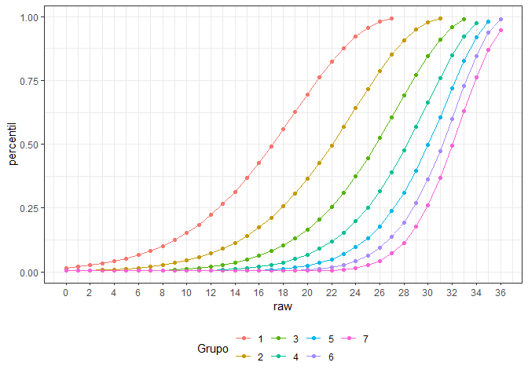

Construcción de normas YR
================

# Teoría de la construcción de normas:

## El problema de la construcción de normas:

La construcción de normas se basan en una muestra que pretende ser
representativa, no solo de una población, sino que también de múltiples
grupos, principalmente de edad o de grado. En la práctica esta tarea es
muy difícil de realizar, ya que contar con muestras para cada grupo de
referencia requiere tamaños muestrales grandes y representa un desafío
logístico importante. El cálculo de normas basadas en distintos
subgrupos está expuesto a resultados poco plausibles, como por ejemplo
que en un subgrupo frente a un mismo puntaje bruto estén asociados
percentiles muy distintos, debido a características de la muestra. Se
supondría en una prueba cognitiva, por ejemplo, que los estudiantes de
10 años tenderían a tener puntajes percentiles más bajos frente al mismo
puntaje bruto de una norma generada por un grupo de estudiantes de 8
años. Esto sin embargo, por características de la muestra podría no
ocurrir.

## Soluciones a este problema:

Es posible suponer que existe una habilidad no observada que explica,
junto con la variable de agrupación (ej. edad), los puntajes brutos. Lo
que se hace es modelar la relación entre puntajes brutos (variable
dependiente) a partir de la variable de agrupación (VI1) y los puntajes
normativos (VI2). La estructura de la relación teórica supuesta permite
utilizar toda la información disponible en los datos. La forma de
hacerlo es a través de la construcción de un plano, tal como ocurre con
la regresión múltiple de 2 variables.

## Supuestos del modelo:

1.- Existe un rasgo latente distribuido normalmente para cada nivel de
la variable explicativa (ej. Edad).

2.- Este rasgo latente explica los puntajes brutos observados. Es
posible experar un cierto puntaje bruto para un cierto nivel del rasgo
latente.

3.- Los puntajes normalizados de la distribución empírica de puntajes
brutos refleja a la variable latente.

4.- Existe una relación monotonamente creciente entre el rasgo latente y
el puntaje bruto observado.

5.- Existe continuidad entre el cambio en la variable explicativa y la
variable observada, la cual no necesariamente es monotonamente creciente
(ej. con la edad hay un crecimiento pero después hay un decrecimiento en
los puntajes de pruebas cognitivas).

## Descripción matemática:

Lo que se modela es el valor esperado bruto, a partir de un puntaje
norma (norm score) y una variable explicativa observada (ej. edad,
curso). Para ello, se utiliza como referencia la norma empírica
(puntajes normalizados) y la variable explicativa. Para ello, se ajustan
modelos de regresión usando polinomios de diverso exponente, buscando
como resultado la mejor aproximación a los datos.

# Construcción de normas Yellow Red:

``` r
yr = read_sav("YR_datos_normas.sav")
yr = yr[1:275,]
yr$Gender = unlabelled(yr$Gender)
yr$SES = unlabelled(yr$SES)
yr$Grade = unlabelled(yr$Grade)
```

Construir normas para cada edad es ineficiente, considerando que existe
una relación matemática evidente entre la edad y los puntajes brutos en
las distintas subpruebas:

``` r
yr %>% dplyr::select(Age, Arrows_Total_Score, Binding_Total_Score, Flies_Total_Score,
              Triads_Total_Score, CatDog_Modif) %>% 
  gather(key=prueba,value=puntaje, -Age) %>% 
  ggplot(aes(x=Age,y=puntaje)) + stat_smooth(span = 3, se=F) + geom_point(alpha=.5,size=1) + theme_bw() +
  facet_wrap(~prueba, scale = "free")
```

    ## Warning: attributes are not identical across measure variables;
    ## they will be dropped

    ## `geom_smooth()` using method = 'loess' and formula 'y ~ x'

    ## Warning: Removed 2 rows containing non-finite values (stat_smooth).

    ## Warning: Removed 2 rows containing missing values (geom_point).

<!-- -->

Adicionalmente, no existe un tamaño muestral suficiente para hacer
normas por edad:

``` r
yr %>% ggplot(aes(x=Age)) + geom_histogram(color="black", fill="lightblue", binwidth = 1) +
  theme_bw() + scale_x_continuous(breaks = seq(6,13,1))
```

<!-- -->

## Arrows

### Elaboración del modelo:

Se tomará el curso como variable de agrupación:

``` r
yr = yr %>% mutate(GradeF = factor(Grade,levels = c("Kinder","1st Grade",
                                         "2nd Grade","3rd Grade",
                                         "4th Grade", "5th Grade",
                                         "6th Grade")))
yr$GradeG = as.numeric(yr$GradeF)
```

``` r
yr %>% ggplot(aes(x=Arrows_Total_Score)) + geom_histogram(color="black",fill="lightblue",binwidth = 1) +
  theme_bw() + facet_wrap(~GradeG, scale="free",ncol = 2) +
  scale_x_continuous(breaks = seq(-10,36,2))
```

<!-- -->

Modelo: puntaje bruto como función del percentil y el grupo de edad.
Aquello permite la construcción de un plano con el que podemos luego
generar las normas.

``` r
resultados = cnorm(raw = yr$Arrows_Total_Score,group = yr$GradeG)
```

    ## Powers of location: k = 5
    ## Powers of age:      t = 3
    ## Multiple R2 between raw score and explanatory variable: R2 = 0.5476
    ## 
    ## Final solution: 5 terms
    ## R-Square Adj. = 0.971593
    ## Final regression model: raw ~ L1 + L2 + A1 + L1A2 + L2A3
    ## Regression function: raw ~ -41.95358018 + (1.483774707*L1) + (-0.008623622026*L2) + (7.295796909*A1) + (-0.01763273653*L1A2) + (1.574670815e-05*L2A3)
    ## Raw Score RMSE = 1.18644

    ## 
    ## Use 'printSubset(model)' to get detailed information on the different solutions, 'plotPercentiles(model) to display percentile plot, plotSubset(model)' to inspect model fit.

<!-- -->

Lo que está diciendo es que existe una función que permite estimar con
una alta presición el puntaje bruto de una persona si es que conocemos
su localización (en percentil) y su grupo de pertenencia.

Podemos utilizar los términos de la función para estimar los puntajes
observados a partir de los percentiles y el grupo de pertenencia, y el
error promedio será de 1.18644 puntos.

``` r
L = 99
A = 2

-41.95358018 + 1.483774707*L + -0.008623622026*L^2 + 
  7.295796909*A + -0.01763273653*L*A^2 + 0.00001574*L^2*A^3
```

    ## [1] 29.26317

## Chequeo del modelo:

``` r
checkConsistency(resultados)
```

    ## 
    ## No violations of model consistency found.

    ## [1] FALSE

``` r
plotRaw(resultados)
```

<!-- -->

## Tablas:

``` r
cursos = c("k","1ro","2do","3ro","4to","5to","6to")

for(i in 1:7){
  assign(str_c("arrows_",cursos[i],"_T"), rawTable(i,resultados, minRaw = -10,maxRaw = 36))
}
```

``` r
arrows_k_T %>% knitr::kable(row.names = F)
```

| raw      |  norm | percentile |
|:---------|------:|-----------:|
| -10 - -2 | 27.22 |        1.1 |
| -1       | 27.35 |        1.2 |
| 0        | 28.36 |        1.5 |
| 1        | 29.39 |        2.0 |
| 2        | 30.44 |        2.5 |
| 3        | 31.52 |        3.2 |
| 4        | 32.61 |        4.1 |
| 5        | 33.73 |        5.2 |
| 6        | 34.87 |        6.5 |
| 7        | 36.04 |        8.1 |
| 8        | 37.24 |       10.1 |
| 9        | 38.46 |       12.4 |
| 10       | 39.72 |       15.2 |
| 11       | 41.02 |       18.5 |
| 12       | 42.36 |       22.2 |
| 13       | 43.74 |       26.6 |
| 14       | 45.16 |       31.4 |
| 15       | 46.64 |       36.9 |
| 16       | 48.18 |       42.8 |
| 17       | 49.79 |       49.1 |
| 18       | 51.47 |       55.8 |
| 19       | 53.24 |       62.7 |
| 20       | 55.11 |       69.5 |
| 21       | 57.11 |       76.2 |
| 22       | 59.27 |       82.3 |
| 23       | 61.62 |       87.7 |
| 24       | 64.23 |       92.3 |
| 25       | 67.22 |       95.7 |
| 26       | 70.81 |       98.1 |
| 27       | 72.78 |       98.9 |
| 28       | 72.78 |       98.9 |
| 29 - 36  | 72.78 |       98.9 |

``` r
arrows_1ro_T %>% knitr::kable(row.names = F)
```

| raw     |  norm | percentile |
|:--------|------:|-----------:|
| -10 - 4 | 27.22 |        1.1 |
| 5       | 27.42 |        1.2 |
| 6       | 28.49 |        1.6 |
| 7       | 29.57 |        2.1 |
| 8       | 30.68 |        2.7 |
| 9       | 31.82 |        3.5 |
| 10      | 32.98 |        4.4 |
| 11      | 34.16 |        5.7 |
| 12      | 35.38 |        7.2 |
| 13      | 36.63 |        9.1 |
| 14      | 37.91 |       11.3 |
| 15      | 39.23 |       14.1 |
| 16      | 40.59 |       17.3 |
| 17      | 41.99 |       21.2 |
| 18      | 43.45 |       25.6 |
| 19      | 44.96 |       30.7 |
| 20      | 46.53 |       36.4 |
| 21      | 48.18 |       42.8 |
| 22      | 49.90 |       49.6 |
| 23      | 51.72 |       56.8 |
| 24      | 53.65 |       64.2 |
| 25      | 55.72 |       71.6 |
| 26      | 57.95 |       78.7 |
| 27      | 60.41 |       85.1 |
| 28      | 63.16 |       90.6 |
| 29      | 66.36 |       94.9 |
| 30      | 70.33 |       97.9 |
| 31 - 36 | 72.78 |       98.9 |

``` r
arrows_3ro_T %>% knitr::kable(row.names = F)
```

| raw      |  norm | percentile |
|:---------|------:|-----------:|
| -10 - 14 | 27.22 |        1.1 |
| 15       | 28.12 |        1.4 |
| 16       | 29.43 |        2.0 |
| 17       | 30.78 |        2.7 |
| 18       | 32.16 |        3.7 |
| 19       | 33.59 |        5.0 |
| 20       | 35.06 |        6.8 |
| 21       | 36.59 |        9.0 |
| 22       | 38.17 |       11.8 |
| 23       | 39.81 |       15.4 |
| 24       | 41.53 |       19.9 |
| 25       | 43.33 |       25.2 |
| 26       | 45.23 |       31.7 |
| 27       | 47.24 |       39.1 |
| 28       | 49.39 |       47.6 |
| 29       | 51.70 |       56.8 |
| 30       | 54.24 |       66.4 |
| 31       | 57.06 |       76.0 |
| 32       | 60.31 |       84.9 |
| 33       | 64.26 |       92.3 |
| 34       | 69.80 |       97.6 |
| 35       | 72.78 |       98.9 |
| 36       | 72.78 |       98.9 |

``` r
arrows_6to_T %>% knitr::kable(row.names = F)
```

| raw      |  norm | percentile |
|:---------|------:|-----------:|
| -10 - 23 | 27.22 |        1.1 |
| 24       | 28.13 |        1.4 |
| 25       | 30.45 |        2.5 |
| 26       | 32.85 |        4.3 |
| 27       | 35.35 |        7.1 |
| 28       | 37.96 |       11.4 |
| 29       | 40.69 |       17.6 |
| 30       | 43.56 |       26.0 |
| 31       | 46.60 |       36.7 |
| 32       | 49.83 |       49.3 |
| 33       | 53.31 |       63.0 |
| 34       | 57.10 |       76.1 |
| 35       | 61.30 |       87.1 |
| 36       | 66.08 |       94.6 |

# Comparación de normas con método tradicional:

La forma tradicional de generar normas considera que cada grupo (ej.
edad) es una muestra distinta a la otra, de modo que no hay cruce de
información. El problema de este método es que es ciego a la relación
que existe entre la variable que representa al grupo, y los puntajes que
se buscan normar.

``` r
arrow_norm_empirica = cNORM::rankByGroup(data=yr, raw = "Arrows_Total_Score", group = "GradeG")
```

``` r
arrow_norm_empirica %>% dplyr::select(GradeG,raw,percentile) %>% 
  ggplot(aes(x=raw,y=percentile,color=factor(GradeG))) + geom_point() +
  geom_line() + theme_bw() +
  theme(legend.position = "bottom") +
  scale_x_continuous(breaks = seq(0,36,2))
```

<!-- -->

``` r
model_norms = data.frame()
for(i in 1:7){
 raw =  c(0:36)
 percentil = pnorm(cNORM::predictNorm(raw = seq(0,36), A = i, model = resultados),50,10)
 dat = data.frame(cbind(i,raw, percentil))
 model_norms = bind_rows(model_norms,dat)
}
```

En contraste con el método anterior, el método de norma propuesto
permite utilizar la información de la variable del grupo como variable
explicativa, moestrando lo que teória y empíricamente debiese ocurrir.
Para ello, el modelo estadístico permite vincular puntajes brutos,
percentiles y la variable explicativa en un todo coherente.

``` r
model_norms %>% ggplot(aes(x=raw, y=percentil, color = factor(i))) +
  geom_point() + geom_line() + theme_bw() +
  theme(legend.position = "bottom") + labs(color="Grupo") +
  scale_x_continuous(breaks = seq(0,36,2))
```

    ## Warning: Removed 20 rows containing missing values (geom_point).

    ## Warning: Removed 20 row(s) containing missing values (geom_path).

<!-- -->
